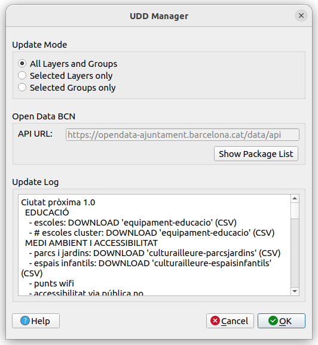
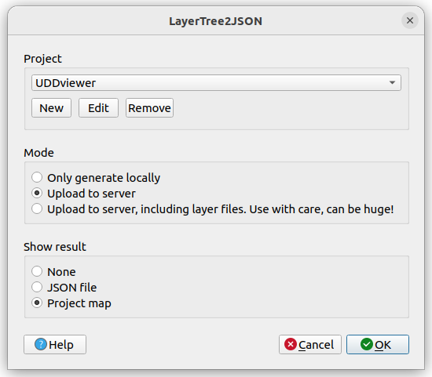

# UDD Manager

QGIS plugin for managing all the web map viewer of BitHabitat UDD. It consists of two main parts:
1. Update layers using Open Data BCN.
2. Write layer information as JSON file used by web map viewer.

## Update layers using Open Data BCN

This tool allows automatic update of all related data files used from [Open Data BCN](https://opendata-ajuntament.barcelona.cat/) using their public API. You can limit the update to certain layers or groups or update everything at once. The log then shows the success of the updates listing all files updated on your computer.

Maybe this function later can be substituted using [QGIS CKAN Browser plugin](https://github.com/BergWerkGIS/QGIS-CKAN-Browser).

## Write layer information as JSON file

Bundeld with UDDManager comes **LayerTree2JSON**, which makes it easy to syncronize your QGIS 3 proyect with a web map viewer. It parses the Qgis project and writes a JSON config file with layer information. It also handles the upload using SFTP.

For more information about installation and usage of this part, have a look at the documentation of QGIS plugin [LayerTree2JSON](https://github.com/geraldo/layertree2json).

